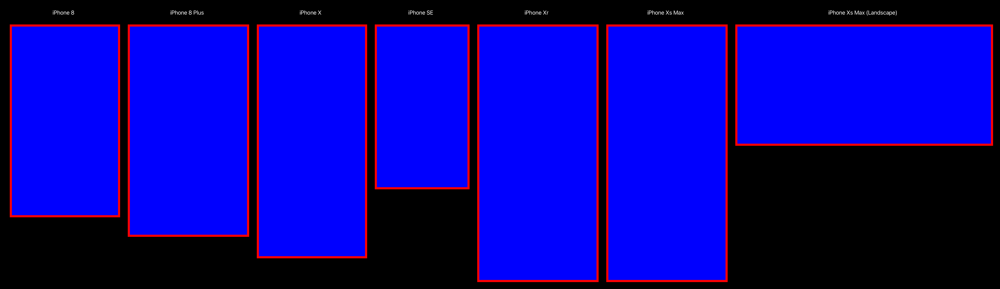

# SnapshotTesting Stitch

[](https://swiftpackageindex.com/Sherlouk/swift-snapshot-testing-stitch) [](https://swiftpackageindex.com/Sherlouk/swift-snapshot-testing-stitch) [](https://twitter.com/JamesSherlouk)

An extension to [SnapshotTesting](https://github.com/pointfreeco/swift-snapshot-testing) which allows you to create images combining the output of multiple snapshot strategies, assuming they all output to `UIImage`.

In essence, this allows you to have a single image which represents a single view in your application, shown in multiple different configurations. This might be useful, for example, where you want to visualise the same UIViewController on multiple devices or in light and dark mode.

Images may also have titles, allowing you to easily identify each configuration within the image.



## Usage

Once [installed](#installation), _no additional configuration is required_. You can import the `SnapshotTestingStitch` module, call `SnapshotTesting` following their usage guide and simply provide our `stitch` strategy as below.

```swift
import SnapshotTesting
import SnapshotTestingStitch
import XCTest

class MyViewControllerTests: XCTestCase {
  func testMyViewController() {
    let vc = MyViewController()

    assertSnapshot(matching: vc, as: .stitch(strategies: [
      .image(on: .iPhone8),
      .image(on: .iPhone8Plus),
    ]))
  }
}
```

### Titles

By default, if you simply provide an array of strategies then these will be untitled. If you instead provide a tuple
containing a string and the strategy then the string will be positioned as a title above the image in the snapshot.

```swift
assertSnapshot(matching: vc, as: .stitch(strategies: [
  ("iPhone 8", .image(on: .iPhone8)),
  ("iPhone 8 Plus", .image(on: .iPhone8Plus)),
]))
```

### Customisation

An optional parameter of the `stitch` strategy is the "style". This value allows you to customise certain parts of the
rendered snapshot generated by the package.

This includes the spacing around the images, the colors used, and an optional border which can surround each image. The
border can be useful for clearly identifying the bounds of each image - especially if the image background is the same
as the snapshot background.

Opinionated defaults have already been provided for you. 

```swift
assertSnapshot(matching: vc, as: .stitch(strategies: [
  ("iPhone 8", .image(on: .iPhone8)),
  ("iPhone 8 Plus", .image(on: .iPhone8Plus)),
], style: .init(
  fontSize: 20,
  titleColor: .white,
  borderColor: .red,
  borderWidth: 5,
  itemSpacing: 32,
  framePadding: 32,
  titleSpacing: 32,
  backgroundColor: .black
)))
```

## Installation

### Xcode 11

> ⚠️ Warning: By default, Xcode will try to add the SnapshotTestingStitch package to your project's main application/framework target. Please ensure that SnapshotTestingStitch is added to a _test_ target instead, as documented in the last step, below.

 1. From the **File** menu, navigate through **Swift Packages** and select **Add Package Dependency…**.
 2. Enter package repository URL: `https://github.com/Sherlouk/swift-snapshot-testing-stitch`
 3. Confirm the version and let Xcode resolve the package
 4. On the final dialog, update SnapshotTestingStitch's **Add to Target** column to a test target that will contain snapshot tests (if you have more than one test target, you can later add SnapshotTestingStitch to them by manually linking the library in its build phase)

### Swift Package Manager

If you want to use SnapshotTestingStitch in any other project that uses [Swift Package Manager](https://swift.org/package-manager/), add the package as a dependency in `Package.swift`:

```swift
dependencies: [
  .package(name: "SnapshotTestingStitch", url: "https://github.com/Sherlouk/swift-snapshot-testing-stitch.git", from: "1.0.0"),
]
```

Next, add `SnapshotTestingStitch` as a dependency of your test target:

```swift
targets: [
  .target(
    name: "MyApp"
  ),
  
  .testTarget(
    name: "MyAppTests", 
    dependencies: [
      .target(name: "MyApp"),
      .product(name: "SnapshotTestingStitch", package: "SnapshotTestingStitch"),
    ]
  ),
]
```

### Other

We do not currently support distribution through CocoaPods or Carthage.

## License

This library is released under the MIT license. See [LICENSE](LICENSE) for details.
